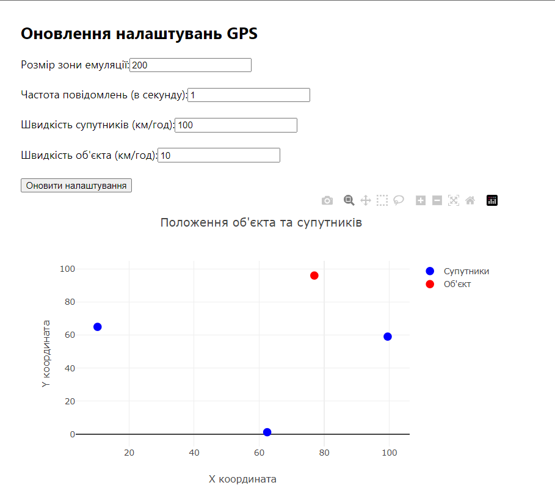

<h3>Розробка додатку для візуалізації вимірювань GPS</h3>

<b>1. Отримання даних через WebSocket</b> 
Налаштовано підключення до WebSocket сервера для отримання даних про супутники у реальному часі.
Отримані дані зберігаються в стані компоненту <code>satellites</code>. При отриманні даних від трьох супутників викликається функція для розрахунку положення об'єкта. 

<b>2. Розрахунок положення об'єкта</b> 
За допомогою функції <code>calculateDistance</code>, яка враховує час, що пройшов між відправкою і отриманням сигналу від супутника, обчислюється відстань до супутників.
Функція <code>trilaterate</code> використовує відстані до трьох супутників для обчислення положення об'єкта в декартових координатах. 

<b>3. Оновлення налаштувань gps</b>  
Створено форму для зміни параметрів gps, яка дозволяє оновлювати розмір зони, частотe повідомлень, швидкість супутників та об'єкта.  

<b>4. Візуалізація на графіку</b> 
Використана бібліотека <code>Plotly</code>, на графіку відображаються супутники (сині точки), так об'єкт (червона точка) в декартових координатах. 

<b>Результат:</b> 

